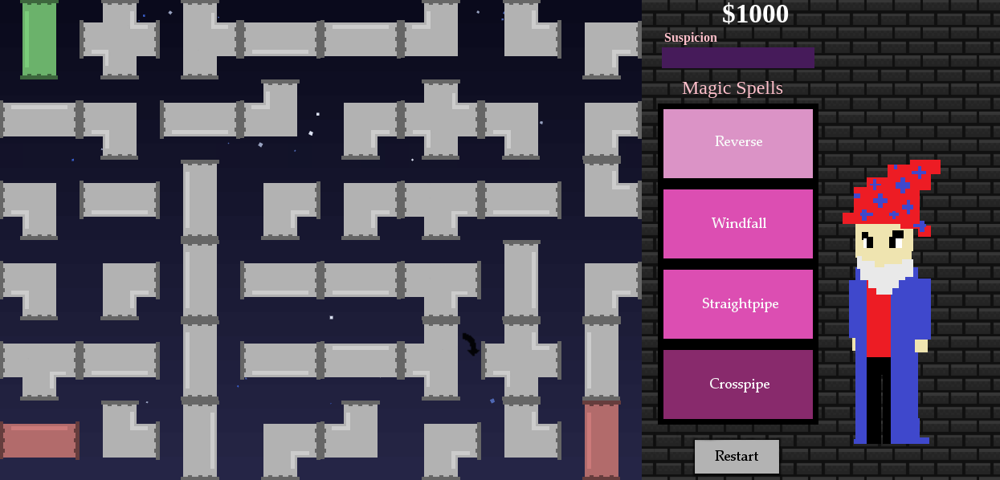

Secret Wizard Corporation
=================

Secret Wizard Corporation is a small prototype game designed and created in two weeks by Nishchal Bhandari, Isaac Rosado, Pravina Saratunga, and Rachel Thornton for the MIT class CMS.611/6.073 Creating Video Games. The game is designed as a flow puzzle game with the addition of magical powers to help when players get stuck. To be successful, players must balance their actions between traditional pipe rotations and magical abilities. 

CHANGELOG
--------

<table style="width:100%">
  <tr>
    <td>Date</td>
    <td>Design Change</td> 
    <td>Notes</td>
  </tr>
  <tr>
    <td>2/29/16</td>
    <td>Game is something inspired by the term "Secret Wizard Corporation"</td> 
    <td>We otherwise have no clue what the game will be about. We don't even know what engine we'll be using.</td>
  </tr>
  <tr>
    <td>3/1/16</td>
    <td>Making game a pipe puzzle, getting from start to end of the puzzle. Players will have to use (unimplemented) magic powers to solve the puzzle.</td> 
    <td>Game is paper prototyped, without the powers in play.</td>
  </tr>
  <tr>
    <td>3/2/16</td>
    <td>Implemented randomized level generation. Can check if puzzle is solved.</td> 
    <td>We still don't know what the powers will be. Why would the players even use them at all?</td>
  </tr> 
  <tr>
    <td>3/4/16</td>
    <td>Added money counter to provide players with a source of in-game pressure.</td> 
    <td>Will this be any fun? Still brainstorming powers.</td>
  </tr>
  <tr>
    <td>3/7/16</td>
    <td>Added buttons that cast magic powers. Players can change tiles into two different types, give themselves more money, and change the direction of a single click. Also, added end states for the game.</td> 
    <td>The penalties for using these powers should be balanced against the money.</td>
  </tr>
  <tr>
    <td>3/9/16</td>
    <td>First focus test session. See focustest1.rtf for more details. Lots of balance changes due to playtests.</td> 
    <td>Game more challenging than we initially thought. Making some asthetic changes at user requests.</td>
  </tr>
  <tr>
    <td>3/11/16</td>
    <td>Added aesthetic touches such as backgrounds and sound effects.</td> 
    <td></td>
  </tr>
  <tr>
    <td>3/14/16</td>
    <td>More balance tweaks, bugfixes, and an ingame character to help players get involved in the game.</td> 
    <td></td>
  </tr>
  <tr>
    <td>3/15/16</td>
    <td>After further focus testing, updated UI to make things more obvious.</td> 
    <td></td>
  </tr>
</table> 
